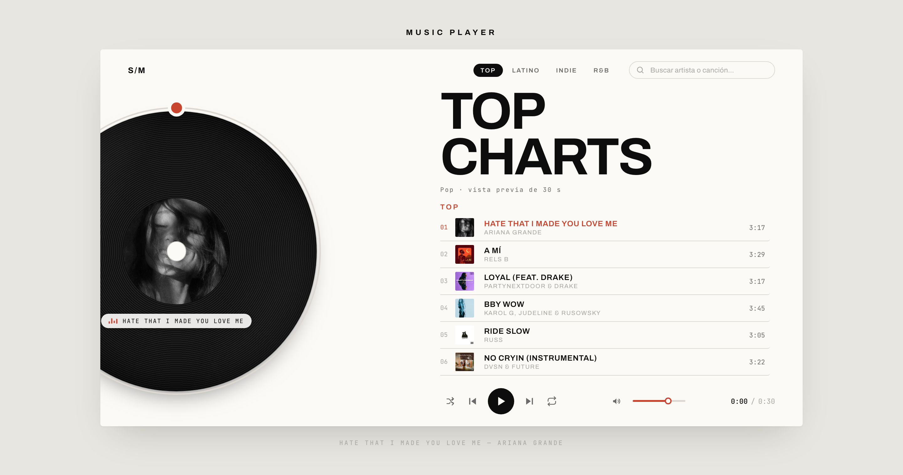

# Music Player

Reproductor de música con estética editorial, construido con React + Vite + iTunes.



## Stack

- React 18 + Vite 6 (sin framework de UI, CSS plano con custom properties)
- Catálogo desde la **iTunes Search API** — sin cuenta ni API key
- Sin dependencias de iconos: los SVG son inline
- Audio con la API `HTMLAudioElement` nativa

## Sobre el catálogo

Las pistas vienen de la [iTunes Search API](https://performance-partners.apple.com/search-api),
un endpoint público de Apple: **no requiere registro, cuenta ni clave**.

Dos límites que conviene conocer:

- **Los audios son vistas previas de 30 s.** Apple no expone las pistas
  completas. La lista muestra la duración real de cada canción, pero lo unico que
  suena son 30 segundos.
- **No hay un endpoint de charts accesible.** Apple publica un feed de "Top
  Songs" en `rss.applemarketingtools.com`, pero no envía cabeceras CORS y el
  navegador lo bloquea. Por eso las colecciones de `src/itunes.js` aproximan el
  top buscando artistas que figuran en esas listas generando un access.

Para editar las colecciones, tocá `COLLECTIONS` en
[`src/itunes.js`](src/itunes.js).

## Desarrollo

```bash
npm install
npm run dev      # http://localhost:5173
npm run build    # genera dist/
npm run preview  # sirve el build
```

## Características

**Reproducción**
- Play / pausa, anterior, siguiente
- Aleatorio (nunca repite la pista actual)
- Repetir: `off` → `all` → `one`
- "Anterior" reinicia la pista si ya pasaron 3 s, como en Spotify

**Catálogo**
- Colecciones curadas: Top, Latino, Indie y R&B
- Búsqueda de cualquier artista o canción, con debounce
- Estados de carga, error con reintento y sin resultados

**Interfaz**
- Vinilo que gira, con anillo de progreso arrastrable alrededor del disco
- Portadas oficiales en 600×600 mod por un regex
- Lista con scroll propio y limitada, para no generar un extend
- Modo claro / oscuro automático según el sistema
- Responsive: dos columnas en escritorio, apilado en móvil

**Accesibilidad**
- Navegable por teclado con foco visible
- `aria-label` / `aria-pressed` en los controles; el anillo expone `role="slider"`
- Respeta `prefers-reduced-motion`

**Integración con el sistema**
- Media Session API: controles nativos y teclas de medios del teclado

**Responsive**
- Se adapta al alto de la ventana, no solo al ancho

### Atajos de teclado

| Tecla | Acción |
| --- | --- |
| `Espacio` | Reproducir / pausar |
| `←` / `→` | Retroceder / adelantar 5 s |
| `Shift` + `←` / `→` | Pista anterior / siguiente |
| `↑` / `↓` | Subir / bajar volumen |
| `M` | Silenciar |
| `S` | Aleatorio |
| `R` | Cambiar modo de repetición |

## Estructura

```
src/
  main.jsx              punto de entrada
  App.jsx               composición del layout
  itunes.js             cliente de la API y colecciones
  hooks/usePlayer.js    motor de audio y estado
  hooks/useCatalog.js   carga del catálogo y búsqueda
  components/
    Vinyl.jsx           disco + anillo de progreso
    TrackList.jsx       lista de pistas
    Controls.jsx        transporte y volumen
    Browser.jsx         pestañas y buscador
    icons.jsx           iconos SVG
  styles/index.css      tokens y estilos
public/
  images/favicon.ico
```

## Deploy

`vite.config.js` usa `base: './'`, así que el contenido de `dist/` funciona en
GitHub Pages desde cualquier subcarpeta:

```bash
npm run build
npx gh-pages -d dist   # o subí dist/ a la rama gh-pages
```
